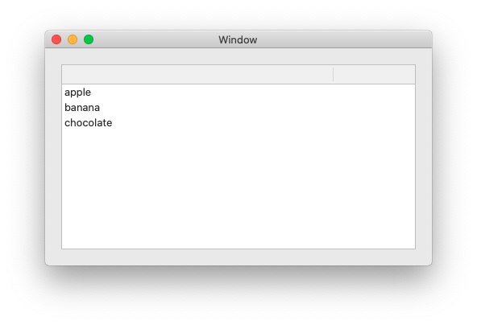

# NSTableViewWithBindings
This is a minimum sample code to show table view with bindings in macOS.

## Description

Data is set in ViewController to NSArrayController object ‘ArrayController’.  
The object is bind to propsArray: [TableProps] . 
So you can see values (tableProps.name) just after setting data to ArrayController.  
And you need some other bind-settings.  

Swift version : 5.1.3

